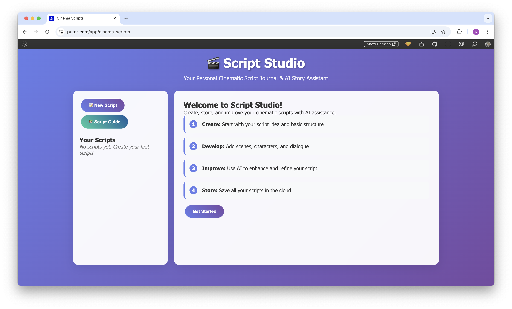

<h1 align="center">
  <a href="https://puter.com/app/cinema-scripts" target="_blank">Script Studio</a>
</h1>

<p align="center">A web-based screenwriting application that helps you create, develop, and enhance cinematic scripts with AI assistance.
</p>

<p align="center">
  
</p>

<br>

## Features

- **Complete Script Management**: Create, edit, save, and organize your screenplay scripts
- **AI-Powered Enhancements**: Improve dialogue, characters, pacing, descriptions, and structure with AI assistance
- **Professional Formatting**: Write scripts with industry-standard screenplay formatting
- **Cloud Storage**: Automatically save all your scripts to the cloud for access anywhere
- **Guided Writing Process**: Step-by-step interface for developing your script from concept to final draft
- **Genre Support**: Specialized templates for various film genres including drama, comedy, horror, and more
- **Modern UI**: Clean, intuitive interface designed for writers
- **No Installation Required**: Runs directly in your browser

<br>

## Getting Started

Clone the repository: 

```bash
git clone https://github.com/puter-apps/ai-script-writer.git
```

and open the `index.html` file in any hosted environment.

Alternatively, access the hosted version at [puter.com/app/cinema-scripts](https://puter.com/app/cinema-scripts).

<br>

## How It Works

Script Studio leverages [**Puter.js**](https://developer.puter.com/) for two key functionalities:

1. **Cloud Storage**: The application uses Puter's key-value store (`puter.kv`) to save and retrieve script data, providing persistent cloud storage without requiring database setup. This allows your scripts to be accessible from any device.

2. **AI Integration**: Script Studio integrates Puter's AI capabilities (`puter.ai.chat`) to provide intelligent script enhancement. The AI can help improve dialogue, develop characters, enhance descriptions, and refine the overall structure of your screenplay while maintaining your original vision.

<br>

## Usage Guide

1. **Create a New Script**: Click "New Script" to start a new screenplay
2. **Enter Basic Information**: Fill in the title, genre, logline, and synopsis
3. **Write Your Script**: Use the script editor with proper screenplay formatting
4. **Enhance with AI**: Select what aspect you want to improve and let AI help refine your script
5. **Save and Manage**: All scripts are automatically saved to the cloud

<br>

## License

MIT
